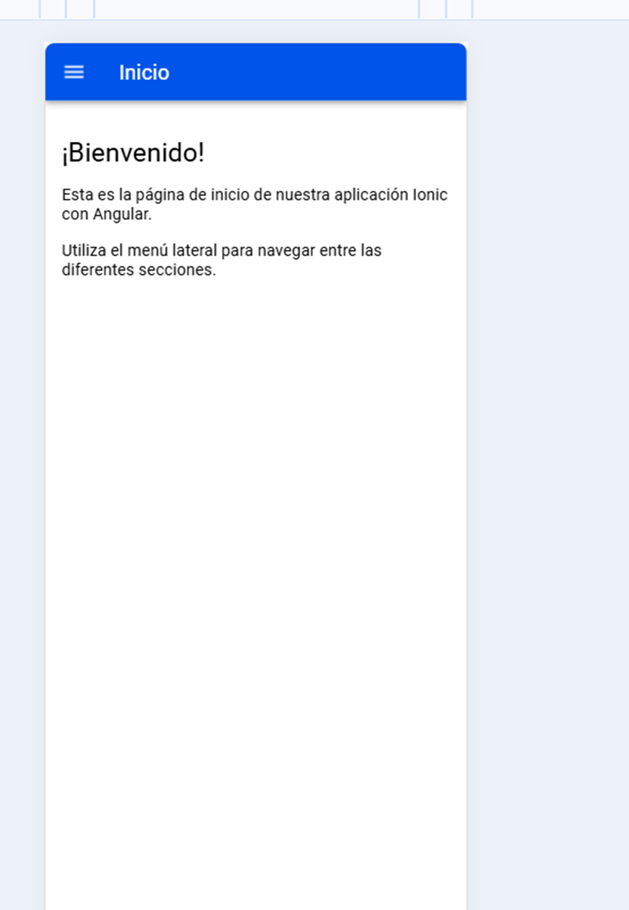
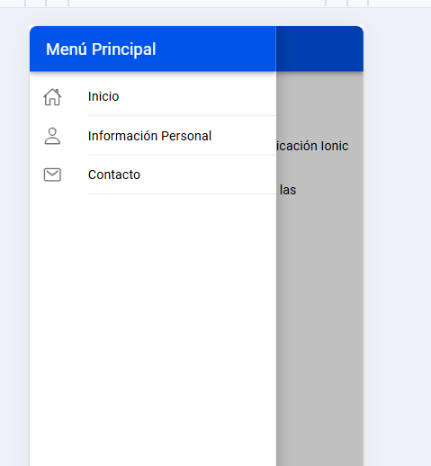
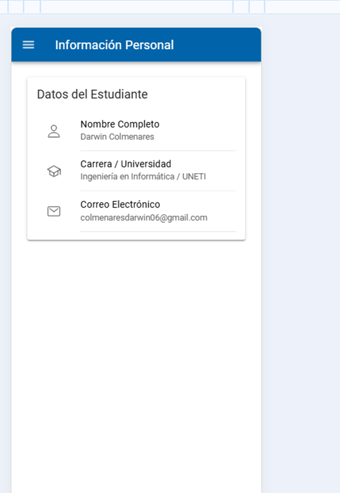
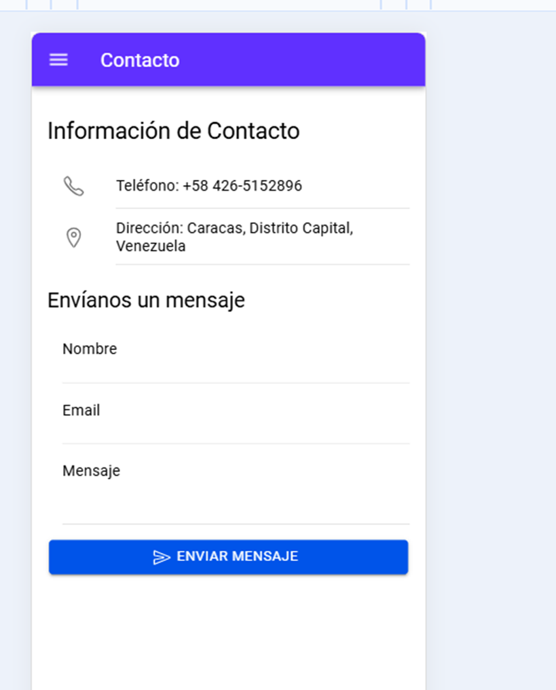

# miAppEvaluacion

Aplicación móvil desarrollada con **Ionic Framework** y **Angular** que implementa un menú lateral (Side Menu) con tres opciones de navegación: Inicio, Información Personal y Contacto.

---

## 📋 Descripción del Proyecto

Esta aplicación fue desarrollada como parte de una evaluación académica para demostrar el uso de componentes de Ionic Framework en conjunto con Angular. El objetivo principal es crear una interfaz de usuario limpia y profesional con navegación mediante un menú lateral deslizable.

### Funcionalidades principales:
- **Menú lateral deslizable** con iconos y navegación entre páginas
- **Página de Inicio** con mensaje de bienvenida
- **Página de Información Personal** con datos del estudiante presentados en tarjetas
- **Página de Contacto** con información de contacto y formulario para enviar mensajes
- **Diseño responsive** adaptable a dispositivos móviles

---

## 🛠️ Tecnologías Utilizadas

| Tecnología | Versión | Descripción |
|------------|---------|-------------|
| Ionic Framework | 8.x | Framework para desarrollo de aplicaciones móviles híbridas |
| Angular | 18.x | Framework de desarrollo frontend de Google |
| TypeScript | 5.x | Lenguaje de programación tipado basado en JavaScript |
| Node.js | 18.x | Entorno de ejecución de JavaScript |

---

## 📁 Estructura del Proyecto
miAppEvaluacion/
├── src/
│   ├── app/
│   │   ├── pages/
│   │   │   ├── inicio/              # Página de bienvenida
│   │   │   ├── informacion-personal/ # Datos del estudiante
│   │   │   └── contacto/            # Información de contacto y formulario
│   │   ├── app.component.ts         # Componente principal con menú lateral
│   │   ├── app.component.html       # Template del menú lateral
│   │   ├── app.routes.ts            # Configuración de rutas
│   │   └── main.ts                  # Punto de entrada de la aplicación
│   ├── index.html                   # Archivo HTML principal
│   └── ...
├── angular.json                     # Configuración de Angular CLI
├── package.json                     # Dependencias del proyecto
├── tsconfig.json                    # Configuración de TypeScript
└── README.md                        # Este archivo


---

## 🚀 Instalación y Ejecución Local

### Requisitos previos:
- Node.js (versión 18 o superior)
- npm (incluido con Node.js)
- Ionic CLI (`npm install -g @ionic/cli`)

### Pasos para ejecutar:

```bash
# 1. Clonar el repositorio
git clone https://github.com/darwinjcn/mi-app-ionic-evaluacion.git

# 2. Navegar al directorio del proyecto
cd mi-app-ionic-evaluacion

# 3. Instalar dependencias
npm install

# 4. Iniciar el servidor de desarrollo
ionic serve

La aplicación se abrirá automáticamente en el navegador en http://localhost:8100

👤 Información del Desarrollador
| Campo                  | Información                                                     |
| ---------------------- | --------------------------------------------------------------- |
| **Nombre**             | Darwin Colmenares                                               |
| **Carrera**            | Ingeniería en Informática                                       |
| **Universidad**        | UNETI (Universidad Nacional Experimental de Telecomunicaciones) |
| **Correo electrónico** | <colmenaresdarwin06@gmail.com>                                  |
| **Teléfono**           | +58 426-5152896                                                 |
| **Ubicación**          | Caracas, Distrito Capital, Venezuela                            |

📸 Capturas de Pantalla
Página de Inicio


Menú Lateral


Página de Información Personal


Página de Contacto


📝 Características del Código
Componentes standalone de Angular: Cada página es un componente independiente con sus propios imports
Documentación exhaustiva: Todo el código fuente incluye comentarios explicativos detallados
Uso de Ionicons: Iconos vectoriales integrados para una interfaz visual profesional
Two-way data binding: Formulario de contacto con sincronización bidireccional de datos
Navegación con Angular Router: Método programático para la navegación entre páginas
📚 Referencias
Ionic Framework Documentation. (2024). https://ionicframework.com/docs
Angular Documentation. (2024). https://angular.dev
Ionicons. (2024). https://ionicons.com

📄 Licencia
Este proyecto fue desarrollado con fines académicos para la asignatura de [nombre de la asignatura] en UNETI.

Nota: Este proyecto es parte de una evaluación académica y no está destinado para producción comercial.